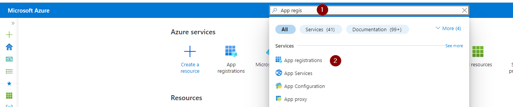
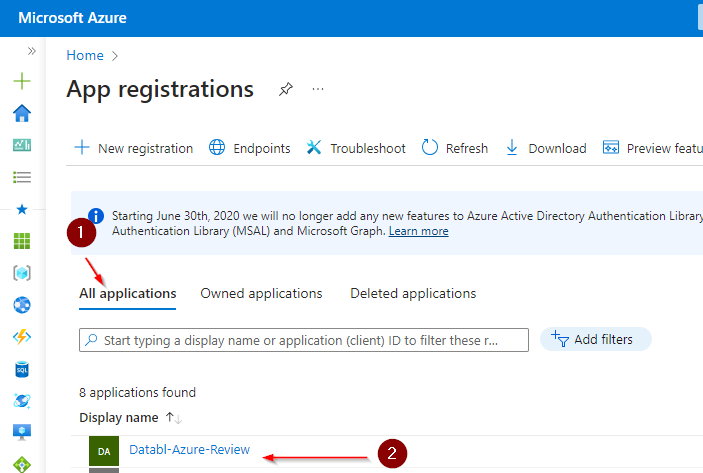
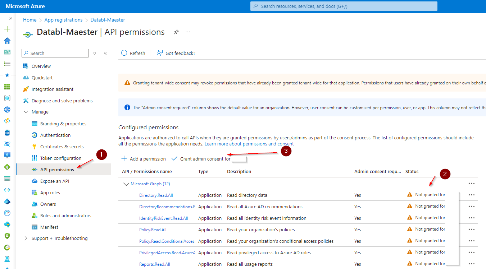

Copy the App registration PowerShell script (**[databl-azure-review-app-registration.ps1](https://github.com/databl/msp/blob/main/app-registration/databl-azure-review-app-registration.ps1))** to your PC and run it from PowerShell as follows.

`PS> databl-azure-review-app-registration.ps1 `

Login to your Azure account when prompted with an account that has permissions to create an App Registrations. 

Copy the information that this script creates and send it to Databl.

eg.
```
Please record the following information and send it to Databl.
####################################################################

TenentID:		     <Tenant ID>
Service Principal:   8d48e952-c2af-43a1-aedb-0c4810a644f0

ClientId:		     9ed3d69f-a091-4497-ab2e-09d5a2fe7aa4
SecretID:            eb34a04d-9fce-462f-af43-f9fe2b90bc46
Client Secret:	     ZWIzNGEwNGQtOWZjZS00NjJmLWFmNDMtZjlmZTJiOTBiYzQ2

####################################################################
```

**Grant the Apps rested permissions.**
Login in to the Azure portal [https://portal.azure.com](https://portal.azure.com )

Search for App Registrations and select it. (fig 1.)


fig1

Go to the All Applications tab (fig2.1) and select the Databl-Maester app (fig2.2)


fig2

Now navigate to API Permissions (fig3.1) 
You will see the status for all the requested Graph permission is Not granted for <your tenancy name> (fig3.2)
To grant the required permissions select grant admin consent for <your tenancy name> (fig3.3) and select Yes to Grant admin consent confirmation.


fig3

You will then see the status change to Granted for <tenancy name>
